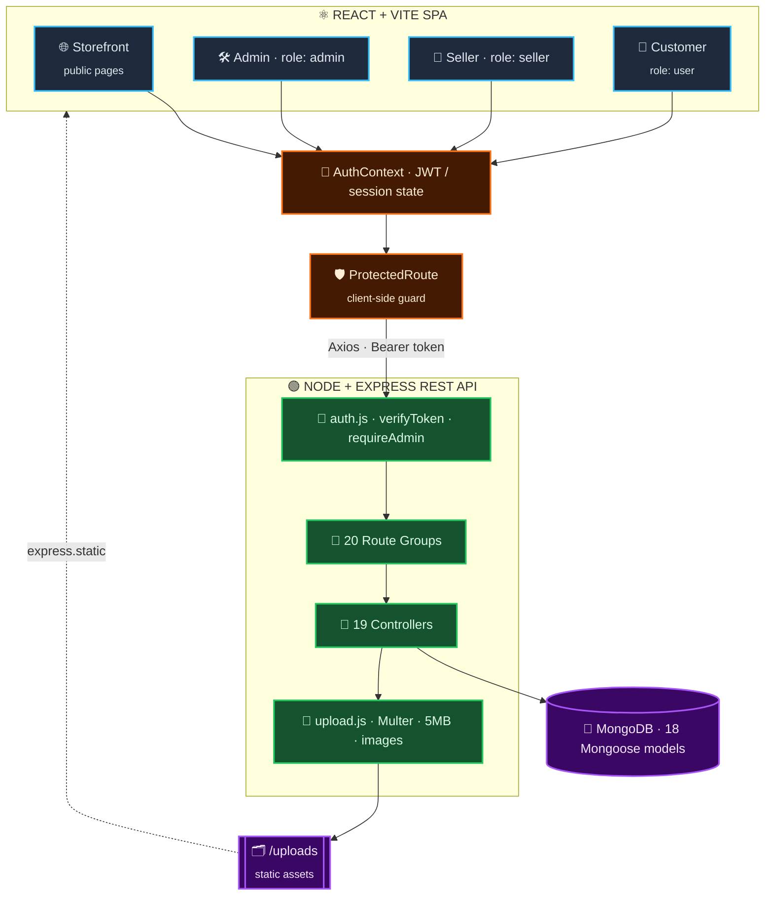
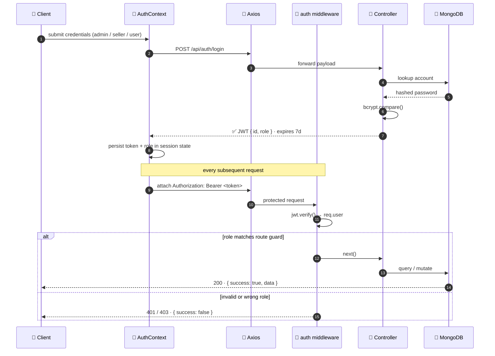
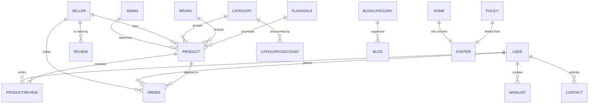
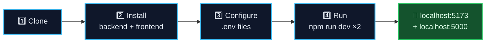

<!-- ═══════════════════════════════════════════════════════════════════════════
     MERN MULTI-VENDOR E-COMMERCE PLATFORM · README
     Author: Nasir Sarkar · https://nasir-sarkar.vercel.app/
     ═══════════════════════════════════════════════════════════════════════ -->

<a name="readme-top"></a>

<div align="center">


<br/>

<!-- ─────────────────────────── CORE STACK ─────────────────────────── -->
<p>
  
</p>

<!-- ─────────────────────────── BADGES ─────────────────────────── -->
<p>
  
  
  
  
  
  
</p>

<p>
  
  
  
  
  
  
</p>

<br/>

<!-- ─────────────────────────── QUICK NAV ─────────────────────────── -->
<table>
<tr>
<td align="center" width="20%">
<a href="#-project-demo"></a>
</td>
<td align="center" width="20%">
<a href="#-key-features"></a>
</td>
<td align="center" width="20%">
<a href="#%EF%B8%8F-tech-stack"></a>
</td>
<td align="center" width="20%">
<a href="#-system-architecture"></a>
</td>
<td align="center" width="20%">
<a href="#-getting-started"></a>
</td>
</tr>
</table>

</div>


## 📊 At a Glance

<div align="center">

| 🧭 Dashboards | 🔌 API Resources | 🗃️ Mongoose Models | 🧠 Controllers | 🎭 Roles | 🖥️ Storefront Pages |
|:---:|:---:|:---:|:---:|:---:|:---:|
| **4** | **20** | **18** | **19** | **3** | **24** |
| Storefront · Admin<br/>Seller · Customer | modular REST<br/>route groups | fully normalized<br/>schemas | one per<br/>resource domain | `admin`<br/>`seller` · `user` | public, SEO-ready<br/>catalog & content |

</div>


## 📖 Overview

> [!NOTE]
> **This is not a storefront clone.** It's a complete multi-vendor marketplace ecosystem — three independent, role-based dashboards sitting on top of a shared public storefront, all backed by a modular REST API with JWT authentication.

This is a **production-style, multi-role e-commerce platform** built with the MERN stack (MongoDB, Express, React, Node.js). It goes far beyond a typical storefront clone — it's a complete marketplace ecosystem with **three independent, role-based dashboards** (Admin, Seller, Customer) sitting on top of a shared public storefront, all backed by a modular REST API with JWT authentication.

The goal of this project was to simulate a real-world, scalable marketplace architecture: dynamic catalog management, order lifecycle handling, seller onboarding & ratings, discount engines, flash sales, wishlists, reviews, and a fully database-driven admin control panel — the kind of system that powers real multi-vendor platforms.

<div align="center">

```
┌──────────────────────────────────────────────────────────────────────────┐
│   ONE CODEBASE  ·  FOUR EXPERIENCES  ·  THREE ISOLATED AUTH SESSIONS     │
├────────────────┬────────────────┬────────────────┬───────────────────────┤
│  🌐 STOREFRONT │  🛠️ ADMIN      │  🏪 SELLER     │  👤 CUSTOMER          │
│  public        │  full control  │  self-service  │  self-service         │
│  no auth       │  role: admin   │  role: seller  │  role: user           │
└────────────────┴────────────────┴────────────────┴───────────────────────┘
```

</div>

<p align="right"><a href="#readme-top">⬆ back to top</a></p>


## 🎥 Project Demo

<div align="center">

> 📺 **A full walkthrough video of the platform (Storefront + Admin + Seller + Customer panels) is available here:**

<a href="https://lnkd.in/p/gMJH9xK2">
  
</a>

</div>

<p align="right"><a href="#readme-top">⬆ back to top</a></p>


## 🖼️ Screenshots

<div align="center">

<table>
<tr>
<td align="center" colspan="2">

### 🏠 Home Page


</td>
</tr>
<tr>
<td align="center" width="50%">

### 👤 Customer Dashboard


</td>
<td align="center" width="50%">

### 🛠️ Admin Dashboard


</td>
</tr>
<tr>
<td align="center" colspan="2">

### 🏪 Seller Dashboard


</td>
</tr>
</table>

</div>

<p align="right"><a href="#readme-top">⬆ back to top</a></p>


## 🧩 System Architecture

<div align="center">



</div>

### 🔐 Authentication Flow

<div align="center">



</div>

### 🗃️ Data Model Map

<div align="center">



</div>

<p align="right"><a href="#readme-top">⬆ back to top</a></p>


## ✨ Key Features

<details open>
<summary><b>🌐 &nbsp;Public Storefront</b> &nbsp;<sub><code>24 pages</code></sub></summary>

<br/>

- Dynamic home page with configurable sections (banners, featured categories, flash deals)
- Product browsing by category, brand, and search with live results
- Detailed product pages with reviews & ratings
- Shopping cart & multi-step checkout flow
- Flash sale campaigns with dedicated deal pages
- Seller storefronts — browse products by individual seller
- Blog system with categories and detail pages
- Wishlist, contact form, and static policy pages (Terms, Privacy, Returns, Support)

</details>

<details open>
<summary><b>🛠️ &nbsp;Admin Dashboard</b> &nbsp;<sub><code>36 pages · 100% DB-driven</code></sub></summary>

<br/>

- Fully **database-driven** control panel (no hardcoded/mock data)
- Product management — add, edit, approve in-house & seller products
- Category, brand, and category-based discount management
- Order management across in-house, seller, and pickup-point orders, plus unpaid order tracking
- Seller management — approvals, ratings, profile edits
- Customer management — add, edit, view customer accounts
- Blog & blog-category management with rich-text (TinyMCE) editor
- Refund request & refund reason management
- Product review moderation
- Home page content settings (banners, featured sections) editable from the panel
- Real-time analytics dashboard with consistent, DB-synced summaries

</details>

<details open>
<summary><b>🏪 &nbsp;Seller Dashboard</b> &nbsp;<sub><code>12 pages · isolated session</code></sub></summary>

<br/>

- Self-service product management (add/edit own listings)
- Order management — view, fulfill, and track orders, pickup points, and unpaid orders
- Refund handling for seller-fulfilled orders
- Seller ratings & profile management
- Dedicated seller authentication flow, isolated from admin/customer sessions

</details>

<details open>
<summary><b>👤 &nbsp;Customer Dashboard</b> &nbsp;<sub><code>9 pages</code></sub></summary>

<br/>

- Order & purchase history tracking
- Wishlist and followed-sellers management
- Digital wallet view
- Refund request submission
- Profile management & account deletion

</details>

<details open>
<summary><b>🔐 &nbsp;Authentication & Authorization</b></summary>

<br/>

- **JWT-based authentication** with role-aware middleware (`admin`, `seller`, `user`)
- Separate, isolated login flows for Admin, Seller, and Customer
- Protected routes on both client and server

</details>

## 🛠️ Tech Stack

<table>
<tr>
<td valign="bottom" width="50%">

### ⚛️ Frontend

**Frontend**
- ⚛️ React (Vite)
- 🎨 Tailwind CSS
- 🧭 React Router DOM
- 🔗 Axios
- 🖼️ Heroicons
- 📝 TinyMCE (rich-text editor)
- 📅 React Datepicker
- 🎯 React Select

<br/>


</td>
<td valign="bottom" width="50%">

### 🟢 Backend

**Backend**
- 🟢 Node.js + Express
- 🍃 MongoDB + Mongoose
- 🔑 JSON Web Tokens (JWT)
- 🔒 bcrypt.js (password hashing)
- 📂 Multer (file uploads)
- 🌐 CORS
- ⚙️ dotenv

<br/>


</td>
</tr>
</table>

<p align="right"><a href="#readme-top">⬆ back to top</a></p>


## 🔌 REST API Surface

<details>
<summary><b>Expand the full route map</b> &nbsp;<sub><code>20 resource groups · base: /api</code></sub></summary>

<br/>

| # | Endpoint | Resource Domain |
|:--:|:---|:---|
| 01 | `/api/products` | Catalog — in-house & seller products |
| 02 | `/api/categories` | Category tree |
| 03 | `/api/brands` | Brand registry |
| 04 | `/api/category-discounts` | Category-based discount engine |
| 05 | `/api/flash-sale` | Flash sale campaigns & deal products |
| 06 | `/api/orders` | Order lifecycle — in-house, seller, pickup, unpaid |
| 07 | `/api/wishlist` | Customer wishlists |
| 08 | `/api/product-reviews` | Product reviews & moderation |
| 09 | `/api/reviews` | Seller ratings |
| 10 | `/api/sellers` | Seller directory, storefronts & ratings |
| 11 | `/api/auth` | Login / registration for all three roles |
| 12 | `/api/manage` | Admin management operations |
| 13 | `/api/dashboard` | DB-synced analytics summaries |
| 14 | `/api/home` | Home page content settings |
| 15 | `/api/footer` | Footer configuration |
| 16 | `/api/policy` | Terms · Privacy · Returns · Support |
| 17 | `/api/blogs` | Blog posts |
| 18 | `/api/blog-categories` | Blog taxonomy |
| 19 | `/api/contact` | Contact form submissions |
| 20 | `/api/upload` | Multer image uploads → `/uploads` |

> [!TIP]
> Every controller returns a consistent envelope — `{ success: boolean, data?, message? }` — so the frontend can handle success and failure uniformly across all 20 resources.

</details>

<p align="right"><a href="#readme-top">⬆ back to top</a></p>


## 📂 Project Structure

```
E-Commerce/
├── frontend/                # React + Vite client
│   └── src/
│       ├── admin/           # Admin dashboard (pages, components, layout)
│       ├── seller/          # Seller dashboard (pages, components, layout)
│       ├── user/            # Customer dashboard (pages, components, layout)
│       ├── pages/           # Public storefront pages
│       ├── components/      # Shared layout & feature components
│       ├── context/         # Auth context (JWT/session state)
│       └── data/            # Static/home page data
│
└── backend/                 # Node.js + Express API
    ├── controllers/         # Business logic per resource
    ├── routes/               # REST API route definitions
    ├── models/               # Mongoose schemas
    ├── middleware/            # Auth & upload middleware
    └── config/                # Database connection
```

<details>
<summary><b>🔬 Zoom in — annotated tree</b></summary>

<br/>

```
E-Commerce/
│
├── 📁 frontend/                     ⚛️  React 18 + Vite 5 SPA
│   ├── index.html
│   ├── vite.config.js
│   ├── tailwind.config.js
│   ├── postcss.config.js
│   └── src/
│       ├── App.jsx                  🧭  Route tree for all four experiences
│       ├── main.jsx
│       ├── index.css                🎨  Tailwind layers
│       │
│       ├── 🛠️ admin/                 36 pages · the control plane
│       │   ├── pages/               Dashboard · Products · Orders · Sellers
│       │   │                        Customers · Blogs · Refunds · Reviews
│       │   │                        HomeSettings · Discounts · Brands
│       │   ├── components/          Admin layout, tables, forms
│       │   └── data/
│       │
│       ├── 🏪 seller/                12 pages · self-service vendor panel
│       │   ├── pages/               Dashboard · Products · Orders
│       │   │                        PickupPoints · Unpaid · Refund · Rating
│       │   ├── components/
│       │   └── data/
│       │
│       ├── 👤 user/                  9 pages · customer account area
│       │   ├── pages/               PurchaseHistory · Wishlist · Wallet
│       │   │                        FollowedSellers · Refunds · Profile
│       │   └── components/
│       │
│       ├── 🌐 pages/                 24 public storefront pages
│       │                            Home · Categories · Brands · Search
│       │                            ProductDetails · Cart · Checkout
│       │                            FlashSale · SellerStore · Blogs · Policies
│       │
│       ├── 🧱 components/
│       │   ├── layout/              Navbar · Footer
│       │   ├── common/              Button · Container · Section
│       │   │                        Breadcrumb · SectionHeader
│       │   │                        ProtectedRoute  🛡️
│       │   └── features/            ProductCard · BlogCard
│       │
│       ├── 🔐 context/               AuthContext.jsx — JWT + role state
│       ├── 📦 data/
│       └── 🖼️ images/
│
└── 📁 backend/                      🟢  Node + Express 5 (ESM)
    ├── index.js                     🚪  Entry — mounts 20 route groups
    │
    ├── 🧭 routes/                    20 REST route definitions
    ├── 🧠 controllers/               19 controllers, one per domain
    ├── 🗃️ models/                    18 Mongoose schemas
    │                                Product · Order · User · Seller · Admin
    │                                Category · Brand · CategoryDiscount
    │                                FlashSale · Review · ProductReview
    │                                Wishlist · Blog · BlogCategory
    │                                Home · Footer · Policy · Contact
    │
    ├── 🛡️ middleware/
    │   ├── auth.js                  generateToken · verifyToken · requireAdmin
    │   └── upload.js                Multer · 5 MB cap · image-only filter
    │
    ├── ⚙️ config/
    │   └── db.js                    Mongoose connection bootstrap
    │
    └── 🗂️ src/uploads/               Served statically at /uploads
```

</details>

<p align="right"><a href="#readme-top">⬆ back to top</a></p>


## 🚀 Getting Started

<div align="center">



</div>

### Prerequisites

<div align="center">

| Requirement | Notes |
|:---|:---|
|  | Node.js installed |
|  | MongoDB (local instance or Atlas cluster) |

</div>

### 1. Clone & Install

```bash
git clone <your-repo-url>
cd E-Commerce

# Install backend dependencies
cd backend
npm install

# Install frontend dependencies
cd ../frontend
npm install
```

### 2. Environment Variables

> [!IMPORTANT]
> Both files are required. The backend won't connect without `MONGO_URI`, and the frontend can't reach the API without `VITE_API_URL`. Keep `.env` out of version control — it's already covered by `.gitignore`.

<table>
<tr>
<td valign="top" width="50%">

**`backend/.env`**
```env
PORT=5000
MONGO_URI=your_mongodb_connection_string
JWT_SECRET=your_jwt_secret
```

</td>
<td valign="top" width="50%">

**`frontend/.env`**
```env
VITE_API_URL=http://localhost:5000/api
```

</td>
</tr>
</table>

<div align="center">

| Variable | Scope | Purpose |
|:---|:---:|:---|
| `PORT` | 🟢 backend | Express listen port — defaults to `5000` |
| `MONGO_URI` | 🟢 backend | Mongoose connection string (local or Atlas) |
| `JWT_SECRET` | 🟢 backend | Signing key for 7-day access tokens |
| `VITE_API_URL` | ⚛️ frontend | Base URL every Axios call is issued against |

</div>

### 3. Run the App

```bash
# Start the backend (from /backend)
npm run dev

# Start the frontend (from /frontend)
npm run dev
```

> [!TIP]
> The frontend `dev` script boots Vite through a small `patch-crypto.cjs` preload, which polyfills `crypto.getRandomValues` on older Node runtimes. On a modern Node version it's a harmless no-op, so `npm run dev` just works either way.

<p align="right"><a href="#readme-top">⬆ back to top</a></p>


## 👨‍💻 Author

<div align="center">

<a href="https://nasir-sarkar.vercel.app/">
  
</a>

### **[Nasir Sarkar](https://nasir-sarkar.vercel.app/)**

**Full-stack MERN Developer**

<br/>

<a href="https://nasir-sarkar.vercel.app/"></a>
<a href="https://www.linkedin.com/in/nasir-sarkar"></a>

</div>

<br/>

> This project was inspired by **ActiveItZone**’s e-commerce demo. Its storefront concept, design direction, visuals, and product presentation were taken as references. It can be considered a partial clone or custom implementation of the original concept. Respect to the original for the inspiration. 🙌

<p align="right"><a href="#readme-top">⬆ back to top</a></p>


<div align="center">

### If you found this project interesting, consider giving it a ⭐!

<br/>


<br/>


</div>
